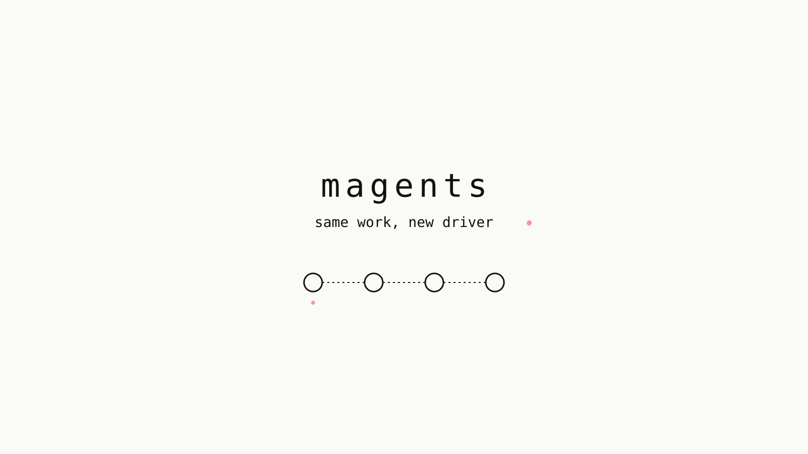

<p align="center">
  
</p>

Claude Code, Codex, Copilot, Cursor, Gemini, Grok, and OpenCode already keep
transcripts on disk. **magents** is the shared API over those sessions - an MCP
server plus a small CLI - so one agent can pick up where another left off
without you recapping, ping a *specific live chat* when you are not sitting in
the middle, or start an independent persisted chat for a complete task.

It is not a second copy of history and not a fire-and-forget council. Existing
chats stay the default unit of work; new chats are for independent work that
benefits from its own session and working directory.

[Install](#install) · [Plugins](#plugins) · [What you can do](#what-you-can-do) · [Quick start](#quick-start) · [Tools](#tools) · [CLI](#cli) · [Releases](https://github.com/abnegate/magents/releases)

## Why

You already run more than one coding agent. The pain is not "more models" - it
is **context trapped in another window**.

| Pain | What magents does |
| --- | --- |
| You switched hosts mid-task | Read the live session and continue *here* |
| Agent A hit a wall Agent B owns | Inject into that live chat without you as the messenger |
| A subtask can run alone | Spawn a headless persisted session with a complete prompt + reply path |

## What you can do

**1. Handoff without a new thread**  
You were in Claude on the disaster-recovery branch. Now you are in Grok. Ask
Grok what they were doing; it reads the live session and continues. No paste
buffer. No "new chat, here's the context."

**2. Send when you are not the messenger**  
Three agents running. Claude hits a wall Codex owns. Claude injects into that
Codex thread and keeps going - especially useful when the sender already has the
failing query, file, and constraint you would otherwise reconstruct.

**3. Spawn independent work**  
When a task can proceed alone, start a new headless persisted session with a
complete prompt, an isolated working directory when files could collide, and a
request to reply through magents. Spawned agents keep their host's native
approval policy - spawning does not add an approval bypass.

## Install

### Homebrew (macOS / Linux)

```bash
brew install abnegate/tap/magents
magents install --all
```

### APT (Debian / Ubuntu)

```bash
curl -fsSL https://abnegate.github.io/apt-repo/pubkey.gpg | sudo gpg --dearmor -o /usr/share/keyrings/abnegate.gpg
echo "deb [signed-by=/usr/share/keyrings/abnegate.gpg] https://abnegate.github.io/apt-repo stable main" | sudo tee /etc/apt/sources.list.d/abnegate.list
sudo apt update && sudo apt install magents
magents install --all
```

### Binary

From [Releases](https://github.com/abnegate/magents/releases):

```bash
curl -LSsf -o magents \
  "https://github.com/abnegate/magents/releases/latest/download/magents-$(uname -m | sed 's/arm64/aarch64/')-$(uname -s | tr 'A-Z' 'a-z' | sed 's/darwin/apple-darwin/;s/linux/unknown-linux-musl/')"
chmod +x magents
./magents install --all
```

Assets: `magents-x86_64-unknown-linux-musl`, `magents-aarch64-unknown-linux-musl`,
`magents-aarch64-apple-darwin`, `magents-x86_64-apple-darwin`.

### Container

```bash
docker pull ghcr.io/abnegate/magents:latest
docker run --rm --user "$(id -u):$(id -g)" \
  -v "$HOME:$HOME" -e HOME \
  ghcr.io/abnegate/magents list --live
```

### From source

```bash
cargo install --path .
magents install --all
```


## Plugins

Host plugins package the magents skill plus an MCP entry that runs `magents mcp`.
Install the CLI first (`brew install abnegate/tap/magents`), then load the matching
folder under [`plugins/`](plugins/).

| Host | Path |
| --- | --- |
| Claude Code | [`plugins/claude`](plugins/claude) |
| Codex | [`plugins/codex`](plugins/codex) |
| Cursor | [`plugins/cursor`](plugins/cursor) |

Details and marketplace notes: [`plugins/README.md`](plugins/README.md).

## Quick start

`magents install --all` registers the stdio MCP server with each installed host,
skipping hosts whose required binaries are unavailable:

- Grok (`grok mcp add magents -- magents mcp`)
- Claude Code (`claude mcp add --scope user magents -- magents mcp`)
- Codex (`codex mcp add magents -- magents mcp`)
- Cursor (`~/.cursor/mcp.json`)
- OpenCode (`~/.config/opencode/opencode.json`)
- Gemini CLI (`gemini mcp add -s user magents magents mcp`)
- GitHub Copilot CLI (`copilot mcp add magents -- magents mcp`)

It also writes the `magents` and `learn` skills under supported hosts' skills
directories (`~/.grok/skills/{magents,learn}`, `~/.claude/skills/{magents,learn}`,
`~/.cursor/skills/{magents,learn}`, and the OpenCode / Gemini / Copilot
equivalents). `/learn` reads every local agent's sessions, not only Grok.

For Grok and Codex only, point a host at the binary yourself:

```toml
[mcp_servers.magents]
command = "/path/to/magents"
args = ["mcp"]
```

Restart the agent session (or refresh `/mcps`) so the tools appear.

Try:

```bash
magents list --live
magents digest grok:latest
magents handoff grok:latest --reason "continuing in grok"
```

## Tools

| Tool | Purpose |
| --- | --- |
| `list_sessions` | Live and recent sessions; filter by `cwd` / `branch` |
| `get_session` | Lookup by id, title, live name, pid, or `agent:ref` |
| `read_transcript` | Compact inert handoff (last request, last action, recent turns) |
| `search_transcripts` | Full-text search across those transcripts |
| `search_memories` | Phrase search over Claude / Codex / Grok memory markdown |
| `create_memory` | Write a note into Claude / Codex / Grok first-party memory |
| `spawn_session` | Start a new headless persisted session for independent work |
| `send_message` | Deliver a user turn to an existing chat |
| `handoff` | Compact this session and inject it into another live chat |
| `inbox` / `ack` / `await_reply` / `reply` | Mailbox for cross-session replies |
| `session_digest` | Compact last request / action / cwd / branch / clipped turns |
| `files_touched` | Paths another session edited |
| `stop_session` | Stop a magents-supervised spawn or resume |
| `read_memory` | Read one Claude / Codex / Grok memory markdown file |
| `get_note` / `put_note` | Magents-owned shared scratch for a working directory |
| `whoami` | Detect this connection; resolve session via env, socket, or unique cwd |
| `learn_collect` | Collect compact records from every local agent's full history for `/learn`, or estimate a run |
| `learn_state` | Read or update `/learn` state, decisions, and trash |

Refs can be prefixed: `claude:disaster recovery`, `grok:latest`, `codex:<uuid>`,
`cursor:latest`, `opencode:<id>`, `gemini:latest`, `copilot:<id>`.

## CLI

```bash
magents list --live
magents list --agent grok --query edge
magents get 'claude:disaster recovery'
magents read grok:latest -n 20
magents digest grok:latest
magents search "dedicated databases" --agent claude
magents spawn codex --prompt-file /path/to/task.md --cwd /path/to/isolated-worktree
magents send grok:latest "handoff: the DR runbook is in docs/RUNBOOK.md"
magents handoff grok:latest --reason "continuing in grok"
magents whoami
magents learn estimate
magents learn collect
magents learn plan
magents learn collect --since-last
magents learn state
```

Pass `--output json` on any command for stable machine-readable stdout.

`magents` with no args on a piped stdin starts the MCP server.

`magents spawn` reads the complete task from stdin by default (`--prompt-file`
supported). Prompt text is never a process argument.

## How sessions talk

`list_sessions` / `read_transcript` / `search_transcripts` / `search_memories`
are the handoff. `create_memory` writes into another harness's first-party
memory (Claude, Codex, or Grok).

Choose the write path by where the work should happen:

- **`spawn_session`** - new, headless, persisted, independent session. Complete
  task, verification, reply-through-magents, isolated `cwd` when edits could
  collide. Success means launch accepted (`accepted: true`, `status: "starting"`),
  not that the task finished.
- **`send_message`** - existing session. Always records mailbox mail; injects a
  live user turn where the host supports one.
- **`handoff`** - compact this session into an existing live session so that
  session continues the same work.

### Delivery routes (existing chats)

`send_message` always appends to the mailbox, then prefers a native live path
and otherwise starts a supervised headless resume:

| Surface | Delivery route |
| --- | --- |
| Claude Desktop | UDS user turn (`/tmp/cc-socks/<pid>.sock`), then tmux or supervised `claude -p --verbose --resume <id>` |
| Claude CLI | UDS when available, then tmux or supervised resume |
| Grok | Supervised `grok --cwd <cwd> --resume <id> --output-format streaming-json --prompt-file /dev/stdin` |
| Codex Desktop / VS Code | Length-prefixed JSON-RPC on `~/.codex/ipc/ipc.sock`, then supervised `codex exec ... resume` |
| Codex CLI | Supervised `codex exec --json -C <cwd> resume <id> -` |
| Cursor | Supervised `cursor-agent -p --output-format stream-json --resume <id> --workspace <cwd>` |
| OpenCode | Supervised `opencode run --format json --dir <cwd> --session <id>` |
| Gemini CLI | Supervised `gemini --resume <id> --output-format stream-json` |
| GitHub Copilot CLI | Supervised `copilot --resume=<id> --output-format json` |

Supervised routes pass the user turn through stdin and do not expose transcript
text, tokens, or raw host output in the response. Spawn never adds approval
bypasses (`--dangerously-skip-permissions`, `--yolo`, `--full-auto`, etc.).

Session discovery sources (unchanged): Claude `~/.claude/sessions`, Grok
`~/.grok/active_sessions.json`, Codex sqlite + rollout JSONL, Cursor
`agent-transcripts`, OpenCode DB, Gemini journals, Copilot `session-state`.

## Tests

```bash
cargo test --locked --all-targets
cargo llvm-cov --locked --all-targets --ignore-filename-regex 'src/main.rs|/rustlib/' --fail-under-lines 98
```

CI runs format, clippy (`-D warnings`), the full test suite, and a 98% line-coverage gate.

## Requirements

- Rust 1.88+
- macOS or Linux (Claude UDS inject is Unix-only)

## License

MIT
